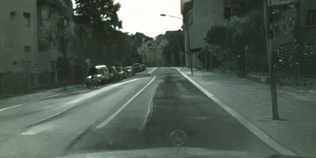
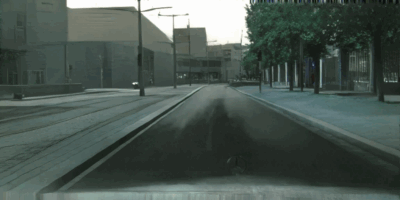

# Navigating the GAN Parameter Space for Semantic Image Editing

Authors official implementation of the CVPR'2021 paper [_Navigating the GAN Parameter Space for Semantic Image Editing_](https://arxiv.org/abs/2011.13786) by Anton Cherepkov, Andrey Voynov, and Artem Babenko.

[](https://colab.research.google.com/drive/15aanLPN6_T2SHp0oQh3stIuESSfpNGuv?usp=sharing)

__Main steps of our approach__:

* _First_: we form a low-dimensional subspace in the parameters space of a pretrained GAN;
* _Second_: we solve an optimization problem to discover interpretable controls in this subspace.

## Typical Visual Effects
###### FFHQ
_original_\
\
<sub>_nose length_</sub>\
\
<sub>_eyes size_</sub>\
\
<sub>_eyes direction_</sub>\
\
<sub>_brows up_</sub>\
\
<sub>_vampire_</sub>\

###### LSUN-Car
\
_Wheels size_
###### LSUN-Church
\
_Add conic structures_
###### LSUN-Horse
\
_Thickness_

#### Real Images Domain

\
\
\


  

#### Pix2PixHD

The proposed method is also applicable to pixel-to-pixel models.
Here we present some of the effects discovered for the [label-to-streetview](https://github.com/NVIDIA/pix2pixHD) model.

\
_Add curb_

\
_Road darkening_

check high-res videos here: [curb1](https://www.dropbox.com/s/3nzxx5cafxmyhxh/add_curb.mp4),
[curb2](https://www.dropbox.com/s/a5ccbcxvtodc89g/add_curb_2.mp4),
[darkening1](https://www.dropbox.com/s/atr4xailywaibht/dark_road.mp4),
[darkening2](https://www.dropbox.com/s/7j9gxofksjzhp67/dark_road_2.mp4)

---

## Training

There are two options to form the low-dimensional parameters subspace: LPIPS-Hessian-based and SVD-based.
The first one is recommended.

#### LPIPS-Hessian-based
Once you want to use the LPIPS-Hessian, first run its computation:

- ##### Calculating hessian's eigenvectors
```
python hessian_power_iteration.py \
    --out result \                             #  script output
    --gan_weights stylegan2-car-config-f.pt \  #  model weigths
    --resolution 512 \                         #  model resolution
    --gan_conv_layer_index 3 \                 #  target convolutional layer index starting from 0
    --num_samples 512 \                        #  z-samples count to use for hessian computation
    --num_eigenvectors 64 \                    #  number of leading eigenvectors to calculate
```

Second, run the interpretable directions search:
- ##### Interpretable directions in the hessian's eigenvectors subspace
```
python run_train.py \
    --out results \                           #  script out
    --gan_type StyleGAN2 \                    #  currently only StyleGAN2 is available
    --gan_weights stylegan2-car-config-f.pt \
    --resolution 512 \
    --shift_predictor_size 256 \              # resize to 256 before shift prediction [memory saving-option]
    --deformator_target weight_fixedbasis \
    --basis_vectors_path eigenvectors_layer3_stylegan2-car-config-f.pt \  # first step results
    --deformator_conv_layer_index 3 \         # should be the same as on the first step
    --directions_count 64 \
    --shift_scale 60 \
    --min_shift 15 \
```

#### SVD-based
The second option is to run the search over the SVD-based basis:

```
python run_train.py \
    --out results \
    --gan_type StyleGAN2 \
    --gan_weights stylegan2-car-config-f.pt \
    --resolution 512 \
    --shift_predictor_size 256 \
    --deformator_target weight_svd \
    --deformator_conv_layer_index 3 \  #  target convolutional layer index starting from 0
    --directions_count 64 \
    --shift_scale 3500 \
    --shift_weight 0.0025 \
    --min_shift 300 \
```

Though we successfully use the same ```shift_scale``` for different layers, its manual per-layer tuning can slightly improve performance.

---

## Evaluation
Here we present the code to visualize controls discovered by the previous steps for:
- SVD;
- SVD with optimization (_optimization-based_);
- Hessian (_spectrum-based_);
- Hessian with optimization (_hybrid_)

First, import the required modules and load the generator:
```
from inference import GeneratorWithWeightDeformator
from loading import load_generator

G = load_generator(
    args={'resolution': 512, 'gan_type': 'StyleGAN2'},
    G_weights='stylegan2-car-config-f.pt'
)
```

Second, modify the GAN parameters using one of the methods below. 
##### SVD-based
```
G = GeneratorWithWeightDeformator(
    generator=G,
    deformator_type='svd',
    layer_ix=3,
)
```
##### Optimization in the SVD basis
```
G = GeneratorWithWeightDeformator(
    generator=G,
    deformator_type='svd_rectification',
    layer_ix=3,
    checkpoint_path='_svd_based_train_/checkpoint.pt',
)
```
##### Hessian's eigenvectors
```
G = GeneratorWithWeightDeformator(
    generator=G,
    deformator_type='hessian',
    layer_ix=3,
    eigenvectors_path='eigenvectors_layer3_stylegan2-car-config-f.pt'
)
```
##### Optimization in the Hessian eigenvectors basis
```
G = GeneratorWithWeightDeformator(
    generator=G,
    deformator_type='hessian_rectification',
    layer_ix=3,
    checkpoint_path='_hessian_based_train_/checkpoint.pt',
    eigenvectors_path='eigenvectors_layer3_stylegan2-car-config-f.pt'
)
```
Now you can apply modified parameters for every element in the batch in the following manner:
```
# Generate some samples
zs = torch.randn((4, 512)).cuda()

# Specify deformation index and shift
direction = 0
shift = 100.0
G.deformate(direction, shift)

# Simply call the generator
imgs_deformated = G(zs)
```

--------

## Saving into a file
You can save the discovered parameters shifts (including layer_ix and data) into a file.
In order to do this:
1. Modify the GAN parameters in the manner described above;
2. Call ```G.save_deformation(path, direction_ix)```.

#### Loading from file
First, import the required modules and load the generator:
```
from inference import GeneratorWithFixedWeightDeformation
from loading import load_generator

G = load_generator(
    args={'resolution': 512, 'gan_type': 'StyleGAN2'},
    G_weights='stylegan2-car-config-f.pt'
)
```

Second, modify the GAN:
```
G = GeneratorWithFixedWeightDeformation(generator=G, deformation_path='deformation.pt')
```

Now you can apply modified parameters for every element in the batch in the following manner:
```
# Generate some samples
zs = torch.randn((4, 512)).cuda()

# Deformate; G.scale is a recommended scale
G.deformate(0.5 * G.scale)

# Simply call the generator
imgs_deformated = G(zs)
```

----

## Pretrained directions
Annotated generators directions and gif examples sources: \
FFHQ: https://www.dropbox.com/s/7m838ewhzgcb3v5/ffhq_weights_deformations.tar \
Car: https://www.dropbox.com/s/rojdcfvnsdue10o/car_weights_deformations.tar \
Horse: https://www.dropbox.com/s/ir1lg5v2yd4cmkx/horse_weights_deformations.tar \
Church: https://www.dropbox.com/s/do9yt3bggmggehm/church_weights_deformations.tar

StyleGAN2 weights: https://www.dropbox.com/s/d0aas2fyc9e62g5/stylegan2_weights.tar \
_generators weights are the original models weights converted to pytorch (see credits)_


You can find loading and deformation example at ```example.ipynb```

----

## Credits
Our code is based on the _Unsupervised Discovery of Interpretable Directions in the GAN Latent Space_ official implementation \
https://github.com/anvoynov/GANLatentDiscovery \
Generator model is implemented over the _StyleGAN2-pytorch_: \
https://github.com/rosinality/stylegan2-pytorch \
Generators weights were converted from the original _StyleGAN2_: \
https://github.com/NVlabs/stylegan2
